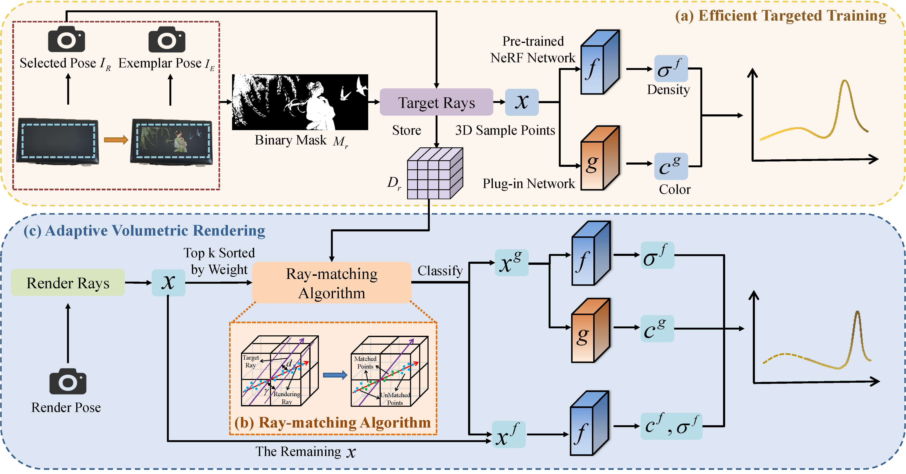

<h2 align="center">
  Loc-Edit: Localized Color Editing in Neural Radiance Fields
</h2>

<p align="center">
    <a href="https://github.com/Lab-PANbin/Loc-Edit/blob/master/LICENSE">
        
    </a>
    <a href="https://github.com/Lab-PANbin/Loc-Edit/pulls">
        
    </a>
    <a href="https://github.com/Lab-PANbin/Loc-Edit/issues">
        
    </a>
    <a href="https://github.com/Lab-PANbin/Loc-Edit">
        
    </a>
    <a href="mailto:xuhaiyang@mail.nankai.edu.cn">
        
    </a>
</p>
<p align="center" style="font-size: 1.2em; font-weight: bold;">
    🎉 <strong>We’re excited to share <a href="https://github.com/Lab-PANbin/Loc-Edit" style="color: #d9534f; text-decoration: none;">Loc-Edit</a> </strong>🎉
</p>


<p align="center">
    Loc-Edit is a localized color editing method for Neural Radiance Fields (NeRF) that enables precise and flexible color modifications in designated regions through a novel ray-matching algorithm and plug-in network design, without requiring conversion to other 3D representations.
</p>

---


<div align="center">
  <a href="https://github.com/voyagerlemon">Haiyang Xu</a><sup>1</sup>,
  <a href="https://xuxiaa.github.io/Homepage/">Xia Xu</a><sup>2*</sup>,
  Yinghao Tan</a><sup>1</sup>,
  Ziye Zhang<sup>1</sup>,
  Nanhe Chen<sup>3,4</sup>, 
  <a href="https://nankai.teacher.360eol.com/teacherBasic/preview?teacherId=5595">Bin Pan</a><sup>1</sup>
  <a href="https://levir.buaa.edu.cn/index_cn.htm">Zhenwei Shi</a><sup>5</sup>
</div>

  
<p align="center">
<i>
1. School of Statistics and Data Science, LEBPS, KLMDASR and LPMC, Nankai University &nbsp; 2. School of Computer Science and Technology, Tiangong University &nbsp; 3. Institute of Cyber-Systems and Control, Zhejiang University &nbsp; 4. Huzhou Institute of Zhejiang University &nbsp; 5. Image Processing Center, School of Astronautics, Beihang University
</i>
</p>

<p align="center">
  **📧 Corresponding author:** <a href="mailto:xuxia@tiangong.edu.cn">xuxia@tiangong.edu.cn</a>
</p>

<p align="center">
<strong>If you like our work, please give us a ⭐!</strong>
</p>

<!-- <p align="center">
<strong>Our work has been accepted by Neurocomputing and will be published soon!</strong>
</p> -->


<p align="center">
  
</p>

## 1. Quick start

### Setup

```shell
conda create -n locEdit python=3.10.18
conda activate locEdit
pip install -r requirements.txt
```


### Data Preparation

<details>
<summary> nerf_llff_data Dataset </summary>

1. Download nerf_llff_data from [GoogleDrive](https://drive.google.com/drive/folders/1RPFq8OHTeXdRCWT-dtObJV2Y0dMznp20?usp=drive_link).
2. Place the downloaded dataset in the data subfolder of the parent directory.
</details>


## 2. Detailed Documentation

For detailed information about directory structure, file descriptions, and complete workflow, please refer to [README_details.md](./README_details.md).

## 3. Citation
If you use `Loc-Edit` or its methods in your work, please cite the following BibTeX entries:
<details open>
<summary> bibtex </summary>

```latex
@article{XU2026133184,
title = {Loc-Edit: Localized color editing in neural radiance fields},
journal = {Neurocomputing},
volume = {678},
pages = {133184},
year = {2026},
issn = {0925-2312},
doi = {https://doi.org/10.1016/j.neucom.2026.133184},
url = {https://www.sciencedirect.com/science/article/pii/S0925231226005813},
author = {Haiyang Xu and Xia Xu and Yinghao Tan and Ziye Zhang and Nanhe Chen and Bin Pan and Zhenwei Shi}
}
```
</details>

## 4. Acknowledgement
Our work is built upon [Mip-NeRF](https://github.com/google/mipnerf).

✨ Feel free to contribute and reach out if you have any questions! ✨
